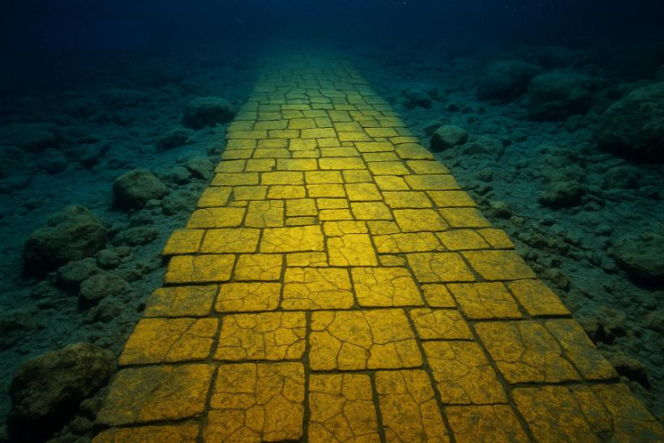
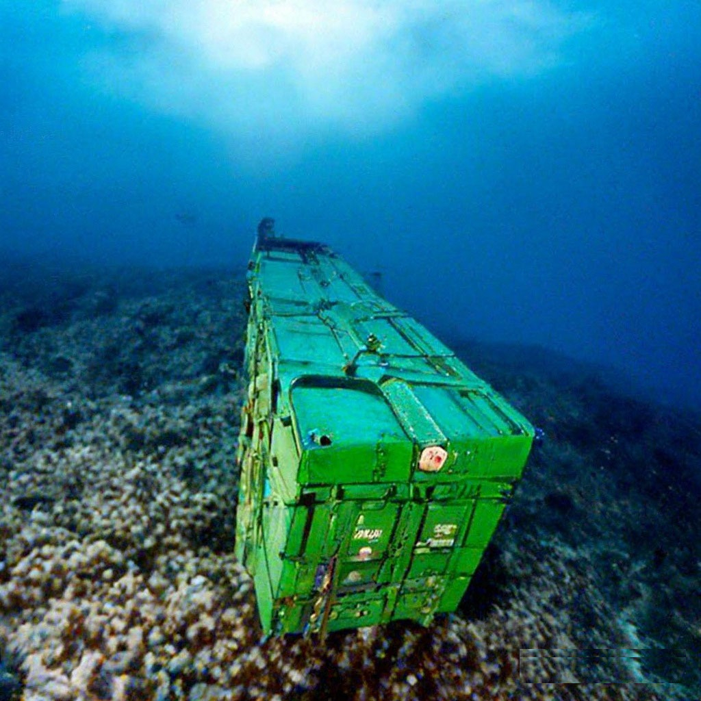

**Регламент соревноварий по подводной робототехнике «Проплыви по коридору»**    
     
**Категория MUR IDE (Эмулятор)**    
     
**Версия 1.0**    
     
**Дата:** 2026-04-16    
     
**Статус:** Проект для обсуждения. Регоамент в стадии разработки    
   
   
 **1. Общие положения**    
     
 **1.1. Цели и задачи соревнований**    
     
 Соревнования проводятся с целью стимулирования интереса к подводной робототехнике, развития инженерных навыков и алгоритмического мышления.    
     
 Основные задачи:    
- Разработка и верификация алгоритмов навигации автономных подводных аппаратов в ограниченном пространстве с использованием эмулятора MUR IDE.    
- Отработка методов технического зрения для распознавания визуальных маркеров (цветных меток) и навигации по линиям.    
- Сравнение эффективности различных подходов к планированию траектории в среде с препятствиями.    
 **1.2. Термины и определения**    
     
| **Термин** |  **Определение** |    
|------------|------------------|  
| **Полигон** | Виртуальная среда (сцена Urho3D), в которой выполняется задание. |    
| **Коридор** | Рабочая зона, ограниченная двумя параллельными жёлтыми линиями на дне бассейна. |    
| **Стартовый круг** | Зона начала движения, зелёный круг диаметром 0.5 м. |    
| **Финишный круг** | Зона завершения движения, красный круг диаметром 0.5 м. |    
| **Метка** | Пассивный визуальный элемент (цветной квадрат 20×20 см). |    
| **Препятствие** | Статический объект, частично или полностью перекрывающий коридор. |    
| **MUR IDE** | Интегрированная среда разработки, используемая для эмуляции подводного аппарата. |    
     
      
 **1.3. Порядок проведения соревнований**    
     
 Соревнования проводятся в дистанционном формате с использованием эмулятора MUR IDE. Участники получают файлы полигонов и должны разработать алгоритмы управления для выполнения миссий. Соревнования состоят из трёх частей:    
1. **Теоретическое задание (проект алгоритма)** – 50 баллов.    
2. **Практическое выполнение миссий в эмуляторе** – 220 баллов (за три задачи).    
3. **Защита решения (постерная сессия в формате PDF)** – 50 баллов.    
 **ИТОГО:** 320 баллов.    
   
   
 **2. Технические требования**    
 **2.1. Поле соревнований (Виртуальная среда)**    
     
 Соревнования проводятся в эмуляторе MUR IDE. Все полигоны представляют собой сцены, созданные в формате Urho3D (XML). Характеристики виртуального бассейна:    
- Размеры виртуального пространства не ограничены, но рабочая зона каждого полигона задаётся жёлтыми линиями.    
- Глубина воды: 0.35 м (от дна до поверхности).    
- Материал дна: тёмно-серый (контрастный к разметке).    
 **2.2. Общая разметка (для всех задач)**    
   
| **Элемент** |  **Цвет** |  **Расположение в виртуальной сцене** |    
|-------------|-----------|---------------------------------------------|     
| Левая граница коридора | Жёлтая линия | X = 0 |    
| Правая граница коридора | Жёлтая линия | X = 2 |   
| Стартовый круг | Зелёный (диаметр 0.5 м) | X = 1, Z = -4 |    
| Финишный круг | Красный (диаметр 0.5 м) | X = 1, Z = 4 |    
     
      
 **2.3. Требования к алгоритму и его представлению**    
- Алгоритм должен быть разработан для автономного движения виртуального аппарата.    
- Должны использоваться данные с виртуальных датчиков (камера для распознавания цвета, датчики для следования по линии).    
- Решение (проект алгоритма) предоставляется в виде блок-схемы или псевдокода с подробными комментариями, поясняющими логику обработки данных с датчиков и принятия решений.    
 **2.4. Требования к виртуальному аппарату**    
     
 В рамках эмулятора все участники используют стандартную модель виртуального аппарата с фиксированными параметрами. Изменение параметров модели или самой модели в файлах эмулятора запрещено. Допускается только написание управляющей программы (скрипта).    
   
   
 **3. Описание миссий и критерии оценки**    
 **Миссия:** Участникам необходимо выполнить три последовательных задания (задачи) в эмуляторе MUR IDE, используя предоставленные файлы полигонов. Каждая задача может быть запущена отдельно.    
   
   
**3.1. Задача 1. Первая миля: путь от стартовой станции к финишному маркеру**    
 ***Легенда***    
   
  
   
 *Подводные аппараты, исследующие глубины океана, всегд* *а начинают свой путь от точки запуска — специальной станции, отмеченной зелёным светом. Финишная зона, обозначенная красным маркером, символизирует успешное завершение исследовательской миссии. Умение автономно и точно перемещаться между двумя заданными то* *чками, не выходя за пределы безопасного коридора, — это базовая, но критически важная задача для любого подводного робота. Эта первая миля закладывает фундамент для всех последующих, более сложных операций: от мониторинга трубопроводов до поисковых миссий.*    
     
**Файл полигона:**  Scenes/GeneratedCorridorWithLines.xml    
     
   
 ***Полигон***    
     
Прямой коридор, ограниченный двумя жёлтыми линиями. Ширина коридора — 2 м (между линиями X=0 и X=2). Длина — 10 м (от Z=-5 до Z=5). В начале коридора (Z=-4) расположен зелёный стартовый круг. В конце коридора (Z=4) расположен красный финишный круг.    
   
**Файл полигона: Scenes/GeneratedCorridorWithLines.xml**    
     
       
**Внешний вид полигона (описание для поиска фото):** Изображение прямого подводного коридора. На тёмно-сером дне чётко видны две ярко-жёлтые линии, идущие параллельно друг другу вдоль всего кадра. В начале и в конце коридора на дне расположены два круга: зелёный (старт) и красный (финиш). Круги имеют чёткие границы. Желательно, чтобы на фото была видна текстура дна и контраст между разметкой и фоном.    
   
   
***Задача робота***    
1. Старт из зелёного круга (виртуальный аппарат полностью находится внутри круга).    
2. Движение по коридору от старта к финишу, не выезжая за жёлтые линии.    
3. Финиш — полная остановка внутри красного круга.    
4.   
 ***Критерии оценки (макс. 5 баллов)***    
   
| **Действие** |  **Баллы** |    
|--------------|------------|  
| Успешный старт (выезд из зелёного круга) | 1 |    
| Прохождение коридора без выезда за жёлтые линии | 2 |    
| Остановка внутри красного финишного круга | 2 |    
     
      
 **Штрафы**    
|-|-|    
|-|-|     
|**Нарушение** |  **Штраф** |    
| Выезд за жёлтую линию (каждое касание) | -1 балл |    
| Финиш вне круга | 0 баллов за финиш |    
   
   
**3.2. Задача 2. Секреты затонувшего контейнеровоза: инвентаризация цветного груза**    
***Легенда***    
   
   
   
   
*На дне исследуемой акватории покоится затонувший контейнеровоз, разбросавший свой груз по морскому дну. Контейнеры с различ* *ными товарами имеют уникальную цветовую маркировку: красные — с кирпичами, жёлтые — с пшеницей, синие — с электроникой, зелёные — с медицинскими принадлежностями. Автономному аппарату предстоит совершить погружение в опасный район, пройти по коридору безоп* *асности (чтобы не потревожить хрупкие обломки) и провести инвентаризацию — обнаружить и классифицировать все цветные контейнеры, идентифицируя их по цвету. Эта задача имитирует реальные операции по оценке ущерба и планированию подводных спасательных работ.*    
   
***Полигон***    
     
Прямой коридор, ограниченный двумя жёлтыми линиями. Ширина коридора — 2 м. Длина — 10 м. Внутри коридора на дне расположены цветные метки-«контейнеры».    
   
**Файл полигона:** Scenes/GeneratedCorridorWithLines4.xml    
**Внешний вид полигона (описание для поиска фото):** Изображение подводного коридора с жёлтыми линиями, зелёным и красным кругами. На дне коридора расположены несколько ярких цветных квадратов (красный, синий, зелёный, жёлтый), напоминающих контейнеры или маркеры. Квадраты имеют чёткую геометрическую форму и контрастируют с тёмным дном.    
***Метки («контейнеры»)***    
     
 Внутри коридора расположены цветные метки-квадраты размером 20×20 см.    
**Возможные цвета:** красный, зелёный, синий, жёлтый.    
**Количество меток:** до 5 штук.    
     
   
Расположение меток, их количество и набор цветов заранее не известны участникам и определяются организаторами перед каждым заездом путём выбора соответствующего XML-файла.    
   
***Задача робота***    
1. Старт из зелёного круга.    
2. Движение по коридору от старта к финишу.    
3. Обнаружить и классифицировать по цвету все метки в коридоре.    
4. Финиш — остановка внутри красного круга.    
   
 ***Критерии оценки (макс. 5 + N баллов)***    
 | | |    
 |-|-|    
 | **Действие** |  **Баллы** |    
 | Успешный старт (выезд из зелёного круга) | 1 |    
 | Прохождение коридора без выезда за жёлтые линии | 2 |    
 | Обнаружение каждой метки (1 балл за метку) | до 5 |    
 | Остановка внутри красного финишного круга | 2 |    
   
    
 **Примечание:** если меток меньше 5, максимальный балл за обнаружение снижается соответственно.    
   
***Штрафы***    
    
| | |    
|-|-|    
| **Нарушение** |  **Штраф** |    
| Выезд за жёлтую линию (каждое касание) | -1 балл |    
| Финиш вне круга | 0 баллов за финиш |    
   
      
***Варианты усложнения (для теоретической части)***    
Обнаружить только контейнеры заданного цвета (например, только красные).    
- Подсчитать общее количество контейнеров.    
- Сообщить последовательность цветов контейнеров (например, «красный, синий, зелёный, жёлтый»).    
   
   
   
**3.3. Задача 3. Обход разрушенного трубопровода**    
***Легенда***    
   
   
  
   
*При проведении планового осмотра подводного трубопровода операторы обнаружили зону аварии — частичное обрушение конструкции. Два крупных фрагмента трубы перекрывают проход: один лежит прямо на дне, другой нависает сверху, почти достигая поверхности. Автономному аппарату требуется продолжить инспекцию, но путь преграждён. Робот должен самостоятельно принять решение: объехать препятствие слева или справа (в рамках реальной задачи — найти проход между фрагментами или выбрать безопасный маршрут в стороне), не задев обломки и не отклонившись от основного коридора. Успешное выполнение этого манёвра демонстрирует развитые навыки планирования траектории в стеснённых условиях.*    
   
***Полигон***    
     
Прямой коридор, ограниченный двумя жёлтыми линиями. Внутри коридора установлены два статических препятствия, имитирующих обломки трубы на всю ширину прохода.    
   
**Файл полигона:** Scenes/GeneratedCorridorWithObstacle.xml    
   
**Внешний вид полигона (описание для поиска фото):** Изображение подводного коридора с жёлтыми линиями. Внутри коридора видны два препятствия красного цвета, перегораживающие путь. Одно препятствие низкое, находится у самого дна (похоже на порог или обрушившуюся балку). Второе препятствие расположено выше, ближе к поверхности (напоминает горизонтальную перекладину или фрагмент трубы). Препятствия контрастируют с окружающей средой.    
 ***Препятствия («обломки трубопровода»)***    
     
 Два статических препятствия на всю ширину коридора (от X=0 до X=2):    
     
| | | | |    
|-|-|-|-|    
| **Препятствие** |  **Расположение (центр масс)** |  **Размеры (Ш × В × Г)** |  **Цвет** |    
| Нижнее | Y = -0.05 м (у дна), Z = 0 м | 2.0 × 0.5 × 0.2 м | Красный |    
| Верхнее | Y = 0.10 м (у поверхности), Z = 1.5 м | 2.0 × 0.2 × 0.2 м | Красный |    
     
      
     
 Препятствия имеют ярко-красный цвет для лучшей видимости.    
   
***Задача робота***    
1. Старт из зелёного круга.    
2. Движение по коридору от старта к финишу.    
3. Обнаружить препятствия и объехать их (слева или справа — по выбору робота, главное — не задеть).    
4. Финиш — остановка внутри красного круга.    
   
***Критерии оценки (макс. 7 баллов)***    
| | |    
|-|-|    
| **Действие** |  **Баллы** |    
| Успешный старт (выезд из зелёного круга) | 1 |    
| Прохождение коридора без выезда за жёлтые линии | 2 |    
| Объезд нижнего препятствия | 1 |    
| Объезд верхнего препятствия | 1 |    
| Остановка внутри красного финишного круга | 2 |    
     
      
***Штрафы***    
     
| | |    
|-|-|    
| **Нарушение** |  **Штраф** |    
| Выезд за жёлтую линию (каждое касание) | -1 балл |    
| Касание препятствия | -1 балл |    
| Финиш вне круга | 0 баллов за финиш |    
    
      
   
 **4. Система оценки**    
     
 Итоговый результат команды определяется суммой баллов за все три части соревнований.    
   
**4.1. Оценка миссий в эмуляторе (макс. 220 баллов)**    
| | |    
|-|-|    
| **Задача** |  **Максимальный балл** |    
| Задача 1. Первая миля | 5 |    
| Задача 2. Секреты контейнеровоза | 5 + N |    
| Задача 3. Обход разрушенного трубопровода | 7 |    
| **ИТОГО за миссию** |  **17 + N** (N — кол-во меток, до 5) |    
     
      
     
Итоговый балл за миссию умножается на 10, таким образом, максимальный балл за практику составляет **220**.    
   
**4.2. Оценка теоретического задания (макс. 50 баллов)**    
     
 Теоретическое задание представляет собой проект алгоритма для одной из трёх задач (на выбор участника). Оценивается:    
- Полнота и логичность блок-схемы/псевдокода (20 баллов).    
- Обоснование выбора датчиков и их роли в алгоритме (15 баллов).    
- Учёт возможных ошибок и исключительных ситуаций (15 баллов).    
   
**4.3. Оценка постерной сессии (макс. 50 баллов)**    
     
 Команда предоставляет постер в формате PDF, на котором схематично представляет свой алгоритм для выбранной задачи. Оценивается наглядность, чёткость и полнота представленной информации.    
   
 **5. Приложения**    
 **5.1. Файлы полигонов в репозитории**    
- Scenes/GeneratedCorridorWithLines.xml — полигон для задачи 1.    
- Scenes/GeneratedCorridorWithLines4.xml — полигон для задачи 2.    
- Scenes/GeneratedCorridorWithObstacle.xml — полигон для задачи 3.    
     
**5.2. Пример структуры теоретического задания (файл **Solution_TaskN.md**)**    
**Решение задачи №X**    
     
     
## 1. Блок-схема алгоритма    
     
**В разработке**  
     
      
     
## 2. Описание работы алгоритма    
**В разработке**     
   
     
      
     
## 3. Обработка ошибок    
     
**В разработке**     
     
      
   
   
